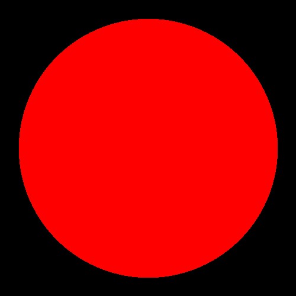
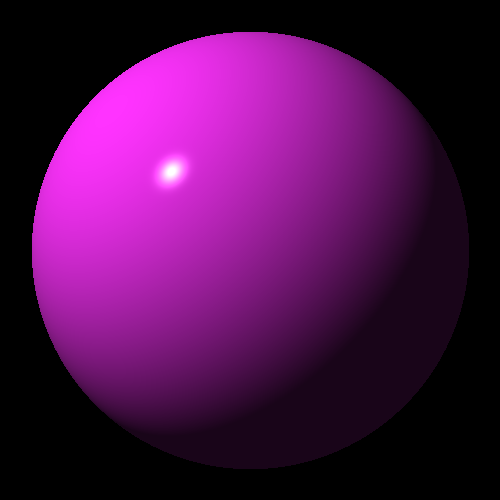
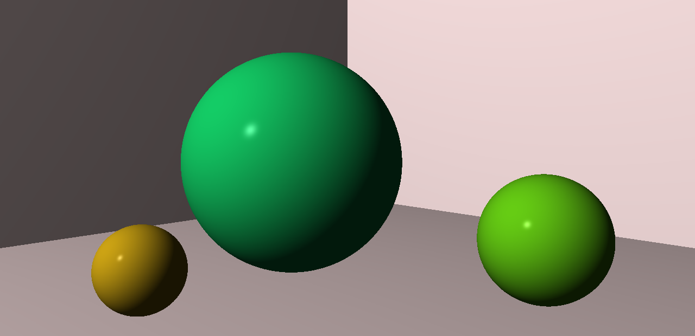
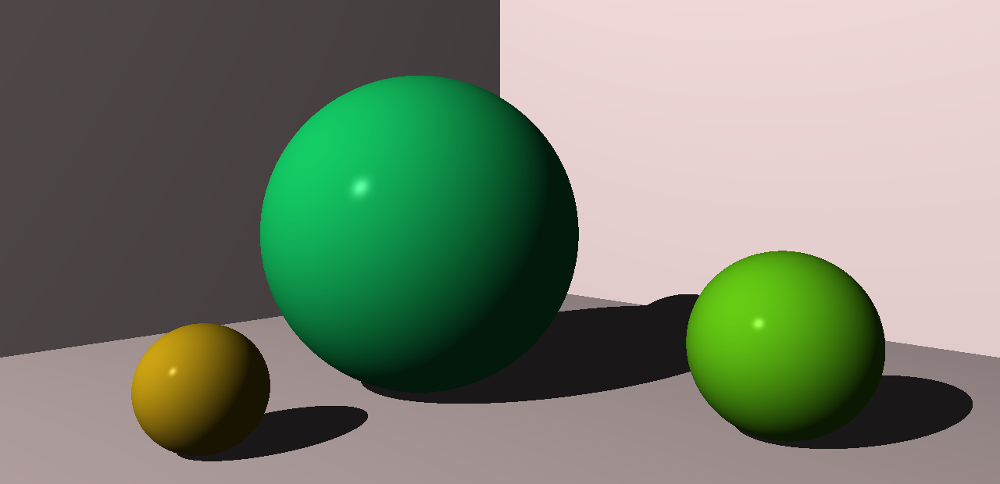
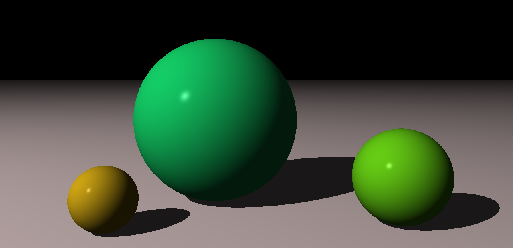

ray-tracer
==========

My implementation of the [Ray Tracer Challenge][rtc] with the focus on learning
[Rust][rust] and hardware acceleration.

Chapter 5 Demo - Red Shadow
---------------------------

Description:

 * create a unit sphere at origin
 * cast a ray originating from (0, 0, -5) at a 7 by 7 canvas at (x, y, 10)
 * for each pixel, color the pixel red if the ray intersects the sphere;
   otherwise, color the pixel black

[code](src/demo/demo5.rs)

Chapter 6 Demo - The Phong Refletcion Model
-------------------------------------------

Description:

 * take the previous demo
 * set the material color of the sphere
 * add a point light source
 * for each pixel, if the ray hits the sphere, compute the lighting at the
   intersection; make the pixel black otherwise

[code](src/demo/demo6.rs)

Chapter 7 Demo - Worlds and Cameras
-----------------------------------

Description:

 * build a world with ball shapes in it
 * add the lighting
 * place the camera at a custom location
 * render the scene using the camera properties

[code](src/demo/demo7and8.rs)

Chapter 8 Demo - Shadows
-----------------------------------

Description:

 * add shadows to the world above

[code](src/demo/demo7and8.rs)

Chapter 9 Demo - Plane
-----------------------------------

Description:

 * remove the squashed spheres that simulate a room from the previous demo
 * add the xz plane at origin

[code](src/demo/demo9.rs)

[rtc]: http://raytracerchallenge.com/
[rust]: https://www.rust-lang.org/

